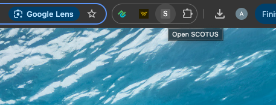

# SCOTUS Docket Search

SCOTUS Docket Search is a Chrome extension that opens and parses the SCOTUS Dockets directly in your browser. It automatically extracts docket history for the last three months from the Supreme Court website.

## Features

- Opens the SCOTUS Docket page and extracts key docket proceedings and orders.
- Captures docket history for the last 3 months.
- Generates a CSV download of the captured search results.

## Installation

1. **Download or Clone the Repository**  
2. ** Install the extension ** by navigating to chrome:extensions (in your browser url bar)
    - Make sure developer mode is toggled on in the top right
3. Select load unpacked in the top left and choose the chrome folder from your download

## Running

Click the extension icon in your extensions bar at the top and it will do the rest for you.

